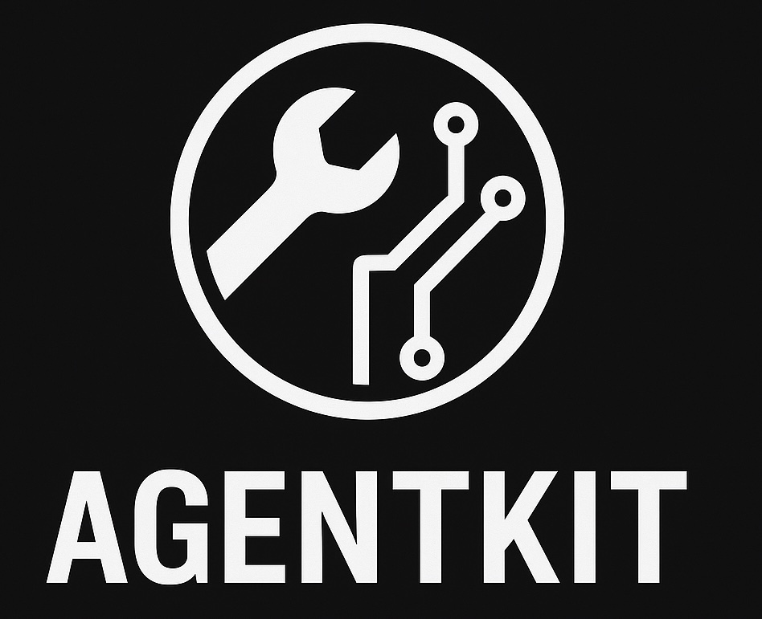

# 🤖 AgentKit

**The Swiss Army knife for AI agents and MCP servers**
A lightweight, flexible toolkit for extending AI agents and MCP servers with modular capabilities. Drop in plugins to instantly give your agents new superpowers!




[](https://www.python.org/downloads/)
[](https://opensource.org/licenses/MIT)

## ✨ Features

- 🔌 **Drop-in Capabilities**: Add new tools by simply dropping Python files or packages in a folder
- 🤖 **AI Agent Ready**: Perfect for Pydantic AI, LangChain, and other agent frameworks
- 🌐 **MCP Server Support**: Built-in integration with Model Context Protocol servers
- 🌍 **Smart Environment Management**: Automatic `.env` template generation and validation
- 📦 **Dependency Handling**: Automatic dependency detection and requirements management
- 🛠️ **CLI Tools**: Command-line interface for managing capabilities
- 🔧 **Platform Aware**: Built-in platform and Python version compatibility checking
- 📋 **Rich Metadata**: Comprehensive capability descriptions, versions, and requirements

## 🚀 Quick Start

### Installation

```bash
# Install AgentKit
pip install -e .

# Or with development dependencies
pip install -e ".[dev]"
```

### Basic Usage

```python
from agentkit import load_plugins

# Load all capabilities from the plugins/ directory
capabilities = load_plugins()

# List available tools
print(capabilities.list_tools())

# Get a specific tool for your agent
notification_tool = capabilities.get_tool("macos_notifier.send_notification")

# Use with your AI agent
result = await notification_tool("Hello from AgentKit!", "Welcome")
```

### With Pydantic AI

```python
from pydantic_ai import Agent
from agentkit import load_plugins

# Load capabilities
capabilities = load_plugins()

# Create agent with all available tools
agent = Agent(
    'openai:gpt-4',
    tools=[capabilities.get_tool(tool) for tool in capabilities.list_tools()]
)

# Your agent now has superpowers!
result = await agent.run("Calculate 2+2 and notify me when done")
```

### With MCP Servers

```python
from fastmcp import FastMCP
from agentkit import load_plugins, create_env_manager

# Load capabilities and environment management
capabilities = load_plugins()
env_manager = create_env_manager(capabilities)

# Create MCP server
mcp = FastMCP(name="My Agent Server")

# Add all capabilities to the server
for tool_name in capabilities.list_tools():
    mcp.add_tool(capabilities.get_tool(tool_name))

# Run the server
await mcp.run()
```

## 🛠️ CLI Usage

AgentKit comes with a powerful CLI for managing your agent capabilities:

```bash
# List all available capabilities
python -m agentkit list

# Generate environment template
python -m agentkit generate

# Validate your environment setup
python -m agentkit validate

# Show environment summary
python -m agentkit summary

# Run comprehensive checks
python -m agentkit check
```

## 🔧 Creating Capabilities

Creating new capabilities for your agents is simple! Just drop a Python file in the `plugins/` directory:

```python
# plugins/my_capability.py

# =============================================================================
# CAPABILITY METADATA
# =============================================================================
_module_info = {
    "name": "My Awesome Capability",
    "description": "Does something amazing for agents",
    "author": "Your Name",
    "version": "1.0.0",
    "dependencies": ["requests>=2.0.0"],
    "environment_variables": {
        "MY_API_KEY": {
            "description": "API key for my service",
            "required": True
        }
    }
}

# =============================================================================
# CAPABILITY IMPLEMENTATION
# =============================================================================
import os
from typing import Annotated
from pydantic import Field

async def my_awesome_function(
    message: Annotated[str, Field(description="Message to process")]
) -> str:
    """Process a message and return something awesome."""
    api_key = os.getenv("MY_API_KEY")
    # Your capability logic here
    return f"Processed: {message}"

# =============================================================================
# EXPORTS
# =============================================================================
_module_exports = {
    "tools": [my_awesome_function]
}
```

That's it! Your capability is now available to all your agents.

## 📦 Built-in Capabilities

AgentKit comes with example plugins out of the box (see plugins).

## 🌍 Environment Management

AgentKit automatically manages environment variables for all your capabilities:

```bash
# Generate .env template with all capability requirements
python -m agentkit generate

# Check if all required variables are set
python -m agentkit validate

# See what environment variables are being used
python -m agentkit summary
```

## 🔍 Dependency Management

Never worry about missing dependencies again:

```bash
# Check capability dependencies
python -m agentkit.depcheck

# Generate requirements file
python -m agentkit.depcheck --generate

# Install all capability dependencies
pip install -r plugin_requirements.txt
```

## 🎯 Use Cases

- **AI Agent Frameworks**: Add tools seamlessly
- **MCP Servers**: Instant tool integration
- **Development Workflows**: Quickly test new agent capabilities
- **Modular Development**: Build reusable capability libraries
- **Team Collaboration**: Share capabilities across projects

## 📚 Examples

Check out the `examples/` directory for complete implementations:

- **`agent_example.py`** - Pydantic AI integration
- **`mcp_example.py`** - MCP server with authentication
- **`custom_agent.py`** - Building a custom agent framework

## 🤝 Contributing

We love contributions! Whether it's:

- 🐛 Bug fixes
- ✨ New built-in capabilities
- 📖 Documentation improvements
- 🧪 Tests and examples

See `CONTRIBUTING.md` for guidelines.

## 📄 License

MIT License - see `LICENSE` file for details.

## 🌟 Why AgentKit?

> *"Why Not?"*

---

**Ready to supercharge your AI agents?** 🚀

```bash
pip install agentkit
python -m agentkit list
# Start building amazing agents!
```
